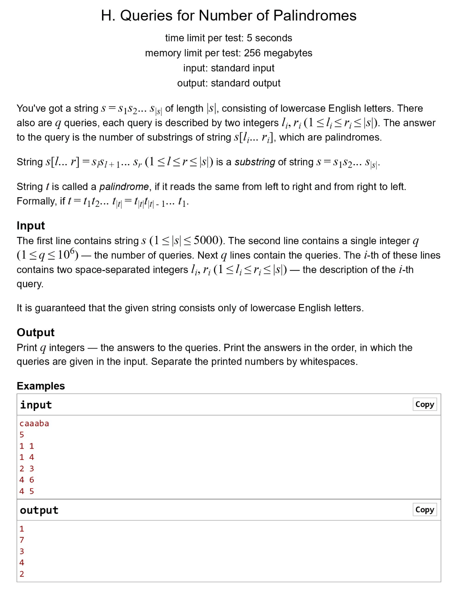

# Assignment 4 
## Muhammad Usman
## BCS233134

##### Question 1

```cpp
#include <iostream>
using namespace std;

bool ispali(const string& str, int start, int end) {
    while (start < end) {
        if (str[start] != str[end]) {
            return false;
        }
        start++;
        end--;
    }
    return true;
}

int Palisub(const string& s, int l, int r) {
    int count = 0;
    for (int i = l - 1; i < r; ++i) {
        for (int j = i; j < r; ++j) {
            if (ispali(s, i, j)) {
                count++;
            }
        }
    }
    return count;
}

int main() {
    // for taking string input
    string s;
    cin >> s;
    
    // for taking position combination
    int comb1[10], comb2[10], out[10];
    int n_pos;
    
    cin >> n_pos;
    

    for (int i = 0; i < n_pos; ++i) {
        cin >> comb1[i] >> comb2[i];
        out[i] = Palisub(s, comb1[i], comb2[i]);
    }
    
    for (int i = 0; i < n_pos; ++i) {
        cout << out[i] << endl;
    }
    
    return 0;
}

```

##### Question 2
Write a C++ program that concatenates two strings str1=”My name is: ”, and str2= name and displays the resulting string in result string.

```cpp
#include <iostream>
#include <string>
using namespace std;

int main()
{
    string str1 = "My name is ",str2 = "usman", result;
    result = str1 + str2;
    cout << result << endl;
    
    return 0;
}

```

##### Question 3
Write a C++ program that replaces all occurrences of a substrings y =”quick”, and z=”lazy” in string x=”The quick brown fox jumped over the lazy dog, but the quick brown dog also jumped over the lazy fox.”. Replace x with y. OR In the actual string where y=”quick” it should be replaced with “lazy” and vice versa. 
```cpp
#include <iostream>
#include <string>
using namespace std;

int main()
{
    string y = "quick",z = "lazy",
    x ="The quick brown fox jumped over the lazy dog, but the quick brown dog also jumped over the lazy fox",last;
    
    int position =0;
    while ((position = x.find(y, position)) != -1) {
        x.replace(position, y.length(), z);
        position += z.length();
    }
    position =0;
    while ((position = x.find(z, position)) != -1) {
        x.replace(position, z.length(), y);
        position += y.length();
    }
    
    cout << x << endl;
    return 0;
}

```

##### Question 4
Write a C++ program that reverses a given string “defied” and displays the reversed version.
```cpp
#include <iostream>
#include <string>
using namespace std;

int main()
{
    string y = "defied";
    
    for (int i = y.length(); i >= 0; i--) {
        cout << y[i];
    }
    cout << endl;
  
    return 0;
}

```

##### Question 5
Write a program to compare two strings and determine if they are equal. e.g. str1 = “Albama”, and str2 = “Al bama”.
```cpp
#include <iostream>
#include <string>
using namespace std;

int main()
{
    string str1 = "Albama", str2 ="Al bama" ;
    
    string result = (str1 == str2)? "equal":"not equal";
  
    cout << result << endl;
    return 0;
}

```

