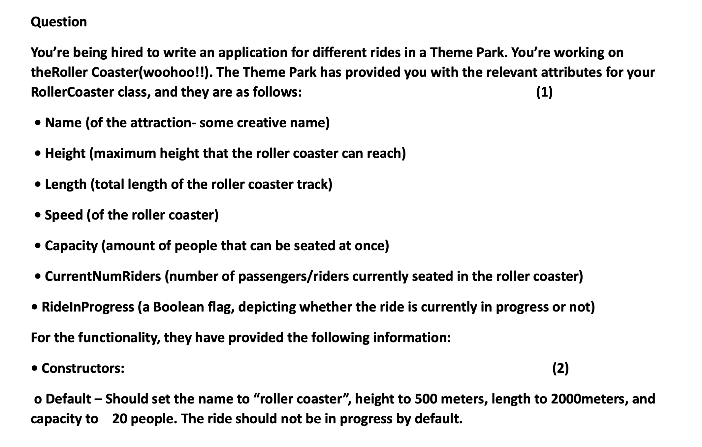
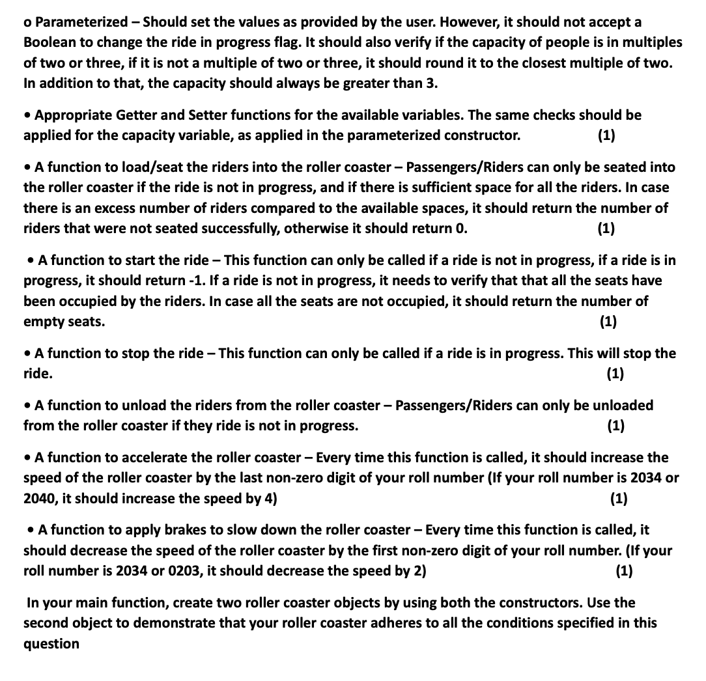

<h1>Assignment Question 1</h1>
<p>
Define a structure called “car”. The member elements of the car structure are:
<li>string Model;</li>
<li>int Year;</li>
<li>float Price</li>

Create an array of 30 cars. Get input for all 30 cars from the user. Then the program should display complete information (Model, Year, Price) of those cars only which are above 500,000 in price.
</p>
<br>
*Edit 3 to 30 in forr Loop
<br>

```
#include <iostream>

using namespace std;
// structure car
struct Car{
    string model;
    int year;
    float price;
    
};
int main() {
    Car arr[30]; // structure calling

    // taking input
    for (int i = 0; i < 3; i++) { 
        cout << "Enter car detail " << i+1 << endl;
        cout << "Enter Car Model, year and price seperated by space :";
        cin >> arr[i].model >> arr[i].year >> arr[i].price;
    }
    // for displaying
    for (int i = 0; i < 3; i++) {
        if (arr[i].price >= 500000) {
            cout << i+1 << " : Model: " <<  arr[i].model << "  Year: "  <<arr[i].year << "  Price: "  << arr[i].price << endl;
        }
         
       
    }
    return 0;
}

```
<h1>Assignment Question 2</h1>

<p>Q: Write a program that implements the following using C++ struct. The program should finally displays contactInfo values for 10 people.</p>


```
#include <iostream>

using namespace std;
// structure a
struct A{
    string city;
    string country;
};
//structure b
struct ContactInfo{
    string name;
    int phoneNo;
    A address;
    
};

int main() {
    // structure call
    ContactInfo arr[10];

    // taking input
    for (int i = 0; i < 3; i++) {
        cout << "Enter contact Detail " << i+1 << endl;
        cout << "Enter Contact Name, Phone No, City And Address seperated by space :";
        cin >> arr[i].name >> arr[i].phoneNo >> arr[i].address.city >> arr[i].address.country; // nested structre calling
    }
    // for displaying
    for (int i = 0; i < 3; i++) {
        
            cout << i+1 << " : Name: " <<  arr[i].name  << "  Phone No: "  <<arr[i].phoneNo<< "  City: "  << arr[i].address.city << "  Country: "  << arr[i].address.country<< endl;
       
    }
    return 0;
}


#Assignment Question 3

<p>Write a C++ program to calculate the total salary of an employee using Classes:
<li>
You must use the following formula to calculate the total salary of an employee:
<li>Basic + HRA + TrasportAllowance + FBPAllowance + Bonus - ProvidentFund - Income Tax – Insurance
<li>You have to declare a class named as Employee Create data member according to total salary of an employee 
<li>Create a function to initialize variables according to total salary of an employee.
<li>You have to calculate total salary of an employee using function named as TotalSalary.
<li>You must create three objects and initialize different data members accordingly.
<li>For first object take the data member values as 50000,7000.5, 1000.5, 300.5, 40.5, 5.5, 6.5, 7.5
<li>For second object take the data member values as 50000,6000.5, 900.5, 200.5, 40.5, 5.5, 6.5, 7.5
<li>For third object take the data member values as 55000,5000.5, 800.5, 100.5, 40.5, 5.5, 6.5, 7.5 
<li>Find the output of 3 different employees' salary by access the member function 
<li>You have also need to show the employee whose slary is maximum salary.using your itp concepts.

<li>using only parameterized constructor. you also know construtor is member function.also explor using This pointer (this->)</p>

```
#include <iostream>
using namespace std;
// class
class Employee
{
    // variables
private:
    double Basic;
    double HRA;
    double TransportAllowance;
    double FBPAllowance;
    double Bonus;
    double ProvidentFund;
    double IncomeTax;
    double Insurance;

public:
// parametrize constuctor
    Employee(double b, double hra, double transport, double fbp, double bonus, double pf, double tax, double insurance)
    {
        Basic = b;
        HRA = hra;
        TransportAllowance = transport;
        FBPAllowance = fbp;
        Bonus = bonus;
        ProvidentFund = pf;
        IncomeTax = tax;
        Insurance = insurance;
    }
    //function
    double TotalSalary()
    {
        return Basic + HRA + TransportAllowance + FBPAllowance +
               Bonus - ProvidentFund - IncomeTax - Insurance;
    }
};
int main()
{
    // class calling and passing value direct to constructor
    Employee emp1(50000, 7000.5, 1000.5, 300.5, 40.5, 5.5, 6.5, 7.5);
    Employee emp2(50000, 6000.5, 900.5, 200.5, 40.5, 5.5, 6.5, 7.5);
    Employee emp3(55000, 5000.5, 800.5, 100.5, 40.5, 5.5, 6.5, 7.5);

    cout << "Total salary for employee 1: " << emp1.TotalSalary() << endl;
    cout << "Total salary for employee 2: " << emp2.TotalSalary() << endl;
    cout << "Total salary for employee 3: " << emp3.TotalSalary() << endl;
    // geting value from class function
    double maxSalary = emp1.TotalSalary();

// for maximum value
    if (emp2.TotalSalary() > maxSalary)
    {
        maxSalary = emp2.TotalSalary();
    }
    if (emp3.TotalSalary() > maxSalary)
    {
        maxSalary = emp3.TotalSalary();
    }
    cout << "Maximum salary among the employees: " << maxSalary << endl;
    return 0;
}

```

#Assignment Question 4



```
#include <iostream>
#include<cmath>
using namespace std;
class RollerCoaster
{
private:
    string name;
    float height;
    float length;
    float speed;
    int capacity;
    int currentNumRiders;
    bool rideInProgress;
    
public:
    
    //default constructor
    RollerCoaster(){
        name = "Roller Coaster";
        height = 500;
        length = 2000;
        capacity = 20;
        rideInProgress = false;
        speed = 0.0;
        currentNumRiders = 0;
    }
    
    // parameterized constructor
    RollerCoaster(string n, float h, float l, float s, int c){
            name = n;
            height = h;
            length = l;
            speed = s;
            capacity = c;
            currentNumRiders = 0;
            rideInProgress = false;
            
            if (capacity <= 3){
                capacity = 4;
            }
            else if (capacity % 2 != 0 || capacity % 3 != 0){
                capacity = round(capacity / 2) * 2;//roundDown =  (numToRound) / multiple) * multiple
            }
    }
    
    // setters
    
    void setName(string n){
        name = n;
    }
    void setHeight(float h){
        height = h;
    }
    
    void setLenght(float l){
        length=l;
    }
    
    void setSpeed(float s){
        speed = s;
    }
    
    void setCapacity(int c){
        if (capacity <= 3)
        {
            capacity = 4;
        }
        else if (capacity % 2 != 0 || capacity % 3 != 0)
        {
            capacity = round(capacity / 2) * 2; //for roundDown round is used cmath used in header
        }
        else
        capacity = c;
    }
    
    void setCurrentNumRiders(int num){
        currentNumRiders = num;
    }
    
    void setrideInProgressress(bool inProgress){
        rideInProgress= inProgress;
    }

    //getters
    
    string getName(){
        return name;
    }
    
    float getHeight(){
        return height;
    }
    
    float getLength(){
        return length;
    }
    
    float getSpeed(){
        return speed;
    }
    
    int getCapacity(){
        return capacity;
    }
    
    int getCurrentNumRider(){
        return currentNumRiders;
    }
    
    bool getrideInProgressress(){
        return rideInProgress;
    }
    
    // start ride
    int startRide() {
        do{
            if (currentNumRiders == capacity) {
                rideInProgress = true;
                return 0;
            }
            else {
                return capacity - currentNumRiders;  // for empty seats
            }
        }
        while (!rideInProgress); //if ride is already in progress
    }
    
    // stop ride
    void stopRide() {
        if (rideInProgress) {
            rideInProgress = false;
        }
    }
    
    void unloadRiders() {
        if (!rideInProgress) {
            currentNumRiders = 0;
        }
    }
    
    // accelerate
    void accelerate() {
        int ld = 4;   // BCS233134
        speed = speed + ld; // dd = last digit
        cout << speed;
    }
    
    // decelerate
    void decelerate() {
        int fd = 2; // BCS233134
        speed = speed- fd; // fd = first digit
        cout << speed;
    }

};

int main() {
    
    RollerCoaster Coaster1;// Using default constructor
    RollerCoaster Coaster2("Falcon's Flight", 190, 4250, 250, 24);// Using parameterized constructor
    cout << "**************************************************" << endl;
    cout << "                           Details of Coaster 1:              " << endl;
    cout << "**************************************************" << endl;
    cout << "Name: " << Coaster1.getName() <<endl;
    cout << "Height: " << Coaster1.getHeight() << " meters" << endl;
    cout << "Length: " << Coaster1.getLength() << " meters" <<endl;
    cout << "Speed: " << Coaster1.getSpeed() << " km/h" <<endl;
    cout << "Capacity: " <<Coaster1.getCapacity() << " people" << endl;
    cout << "Current Number of Riders: " << Coaster1.getCurrentNumRider() <<endl;
    cout << "Ride In Progress: " << Coaster1.getrideInProgressress() <<endl;
    cout << "\n";
    cout << "**************************************************" << endl;
    cout << "                           Details of Coaster 2:              " << endl;
    cout << "**************************************************" << endl;
    cout << "Name: " << Coaster2.getName() << endl;
    cout << "Height: " << Coaster2.getHeight() << " meters" << endl;
    cout << "Length: " <<Coaster2.getLength() << " meters" << endl;
    cout << "Speed: " << Coaster2.getSpeed() << " km/h" << endl;
    cout << "Capacity: " << Coaster2.getCapacity() << " people" << endl;
    cout << "Current Number of Riders: " << Coaster2.getCurrentNumRider() <<endl;
    cout << "Ride In Progress: " << Coaster2.getrideInProgressress() << endl;
    
    cout << "\n";
    cout << "**************************************************" << endl;
    cout << "                             Acceleration " << endl;
    cout << "**************************************************" << endl;
    
    cout << "Coaster 1: ";
    Coaster1.accelerate();
    cout << endl;
    
    cout << "Coaster 2: ";
    Coaster2.accelerate();
    cout << endl;
    
    cout << "**************************************************" << endl;
    cout << "                            Deceleration " << endl;
    cout << "**************************************************" << endl;
    
    cout << "Coaster 1: ";
    Coaster1.decelerate();
    cout << endl;
    cout << "Coaster 2: ";
    Coaster2.decelerate();
    cout << endl;
    
    cout << "**************************************************" << endl;
    cout << "                                    End" << endl;
    cout << "**************************************************" << endl;
    return 0;
}

```
