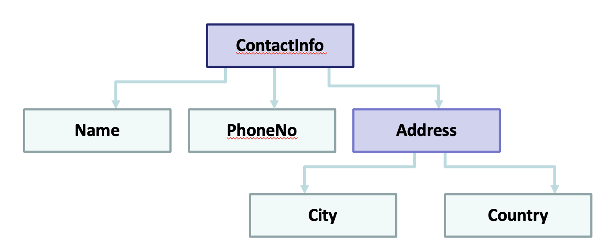

#Assignment Question 1
<p>
Define a structure called “car”. The member elements of the car structure are:
<li>string Model;</li>
<li>int Year;</li>
<li>float Price</li>

Create an array of 30 cars. Get input for all 30 cars from the user. Then the program should display complete information (Model, Year, Price) of those cars only which are above 500,000 in price.
</p>
<br>
*Edit 3 to 30 in forr Loop
<br>

```
#include <iostream>

using namespace std;

struct Car{
    string model;
    int year;
    float price;
    
};
int main() {
    Car arr[30];
    for (int i = 0; i < 3; i++) {
        cout << "Enter car detail " << i+1 << endl;
        cout << "Enter Car Model, year and price seperated by space :";
        cin >> arr[i].model >> arr[i].year >> arr[i].price;
    }
    for (int i = 0; i < 3; i++) {
        if (arr[i].price >= 500000) {
            cout << i+1 << " : Model: " <<  arr[i].model << "  Year: "  <<arr[i].year << "  Price: "  << arr[i].price << endl;
        }
         
       
    }
    return 0;
}

```
#Assignment Question 2

<p>Q: Write a program that implements the following using C++ struct. The program should finally displays contactInfo values for 10 people.</p>



```
#include <iostream>

using namespace std;

struct A{
    string city;
    string country;
};
struct ContactInfo{
    string name;
    int phoneNo;
    A address;
    
};
int main() {
    ContactInfo arr[10];
    for (int i = 0; i < 3; i++) {
        cout << "Enter contact Detail " << i+1 << endl;
        cout << "Enter Contact Name, Phone No, City And Address seperated by space :";
        cin >> arr[i].name >> arr[i].phoneNo >> arr[i].address.city >> arr[i].address.country;
    }
    for (int i = 0; i < 3; i++) {
        
            cout << i+1 << " : Name: " <<  arr[i].name  << "  Phone No: "  <<arr[i].phoneNo<< "  City: "  << arr[i].address.city << "  Country: "  << arr[i].address.country<< endl;
       
    }
    return 0;
}

```